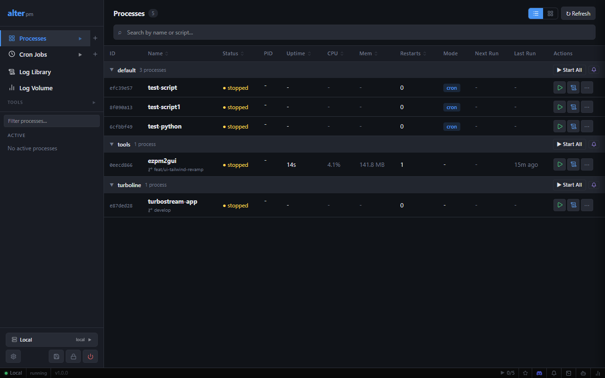
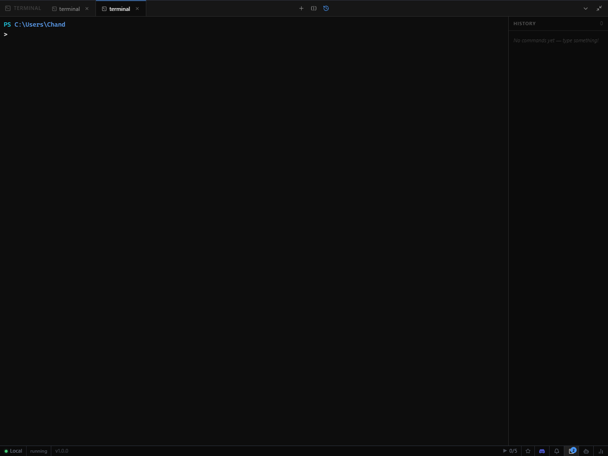
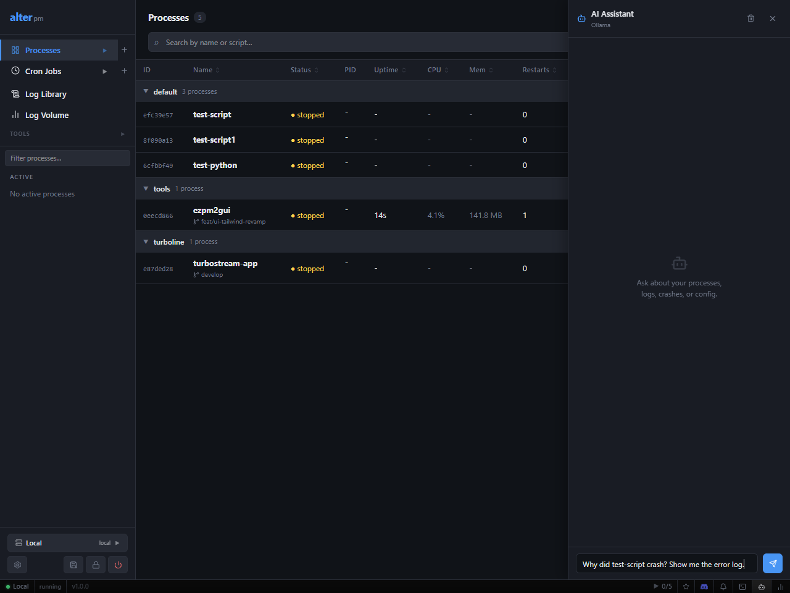

# alter — Process Manager

> A fast, lightweight process manager for Windows (and cross-platform). Run and manage any application — Python, Node.js, Go, Rust, .NET, PHP — from a single binary with a built-in web dashboard.

[](./LICENSE)
[](https://www.rust-lang.org/)
[]()
[](https://github.com/microsoft/winget-pkgs)

---

## Installation

### WinGet (recommended)

```powershell
winget install thechandanbhagat.alter
```

### Manual installer

Download the latest `alter-x.x.x-windows-x64-setup.exe` from [Releases](https://github.com/thechandanbhagat/alter-pm/releases) and run it.  
`alter.exe` is added to your `PATH` automatically.

---

## Features

- **No console window popups** — processes run silently in the background (Windows)
- **Auto-restart** with exponential backoff on crash
- **Watch mode** — restart automatically on file changes
- **Namespaces** — group and bulk-control related processes
- **Web dashboard** — real-time process monitor at `http://localhost:2999/`
- **Live log streaming** — tail logs in terminal or browser
- **State persistence** — save and restore your process list across reboots
- **Ecosystem config** — define all apps in one TOML or JSON file
- **Full REST API** — automate everything
- **Single binary** — no runtime dependencies
- **Dashboard authentication** — password-protect the web UI with Argon2id hashing, session tokens, and a PIN quick-unlock
- **Telegram bot** — control your processes from Telegram: list, start, stop, restart, tail logs, and receive crash/restart alerts
- **AI assistant** — multi-provider chat panel (Ollama, GitHub Models, Claude, OpenAI-compatible) with streaming responses and process-aware context
- **Port Finder** — scan all open TCP/UDP ports, see owning processes, and kill by PID from the dashboard
- **Notifications** — Slack, Discord, Microsoft Teams, and webhook alerts on crash, restart, cron events, and more
- **Process enable/disable** — exclude individual processes from Start All without removing them
- **Terminal history** — per-process command history persisted across sessions
- **Sidebar namespace groups** — active processes grouped by namespace with collapsible sections and bulk stop/restart

### Build from source

Requires [Rust](https://rustup.rs/).

```powershell
git clone https://github.com/thechandanbhagat/alter-pm
cd alter-pm
cargo build --release
# Binary: target\release\alter.exe
```

---

## Screenshots

<table>
  <tr>
    <td align="center" width="50%">
      <br/>
      <sub>Process list — namespace groups, status, CPU &amp; memory</sub>
    </td>
    <td align="center" width="50%">
      <br/>
      <sub>Built-in terminal — multi-tab, split pane, persistent history</sub>
    </td>
  </tr>
  <tr>
    <td align="center" colspan="2">
      <br/>
      <sub>AI assistant — ask about crashes, logs, or config (Ollama, Claude, OpenAI, Copilot)</sub>
    </td>
  </tr>
</table>

---

## Quick Start

```powershell
# Start the daemon
alter daemon start

# Start processes
alter start python -- -m http.server 8080
alter start node --name api -- server.js
alter start "go run main.go" --name backend --cwd C:\projects\api

# List processes
alter list

# Stream logs
alter logs api --follow

# Open web dashboard
alter web    # → http://127.0.0.1:2999/
```

---

## Windows

alter is built with Windows as a first-class platform:

- Spawned processes use `CREATE_NO_WINDOW` — **no black console popups**
- Daemon runs completely hidden in the background
- `npm`, `yarn`, `npx` and other `.cmd` scripts work directly
- Terminal button opens Windows Terminal or `cmd.exe` in the process directory
- Data stored in `%APPDATA%\alter-pm2\`

---

## Ecosystem Config

```toml
# alter.config.toml
[[apps]]
name      = "api"
script    = "python"
args      = ["-m", "uvicorn", "main:app", "--port", "8000"]
cwd       = "C:\\projects\\api"
namespace = "web"
[apps.env]
PORT = "8000"

[[apps]]
name      = "worker"
script    = "node"
args      = ["dist/worker.js"]
watch     = true
namespace = "workers"
[apps.env]
NODE_ENV = "production"
```

```powershell
alter start alter.config.toml
```

---

## Documentation

Full documentation is in [`docs/`](./docs/):

| Document | Description |
|----------|-------------|
| [README](./docs/README.md) | Full project overview and setup guide |
| [CLI Reference](./docs/CLI.md) | All commands, flags, and examples |
| [API Reference](./docs/API.md) | Full REST API documentation |
| [Ecosystem Config](./docs/ECOSYSTEM_CONFIG.md) | Config file format reference |
| [Architecture](./docs/ARCHITECTURE.md) | How alter works under the hood |
| [Changelog](./docs/CHANGELOG.md) | Version history |

---

## License

MIT — see [LICENSE](./LICENSE) for details.
