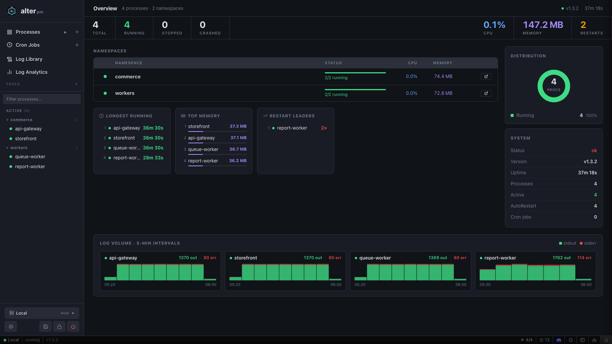
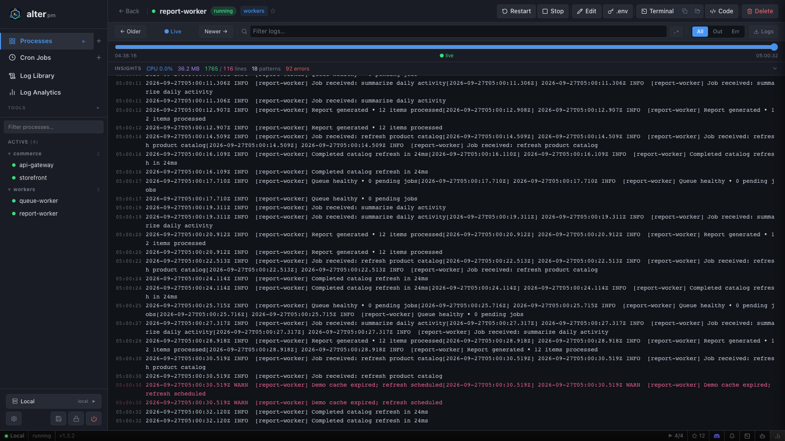
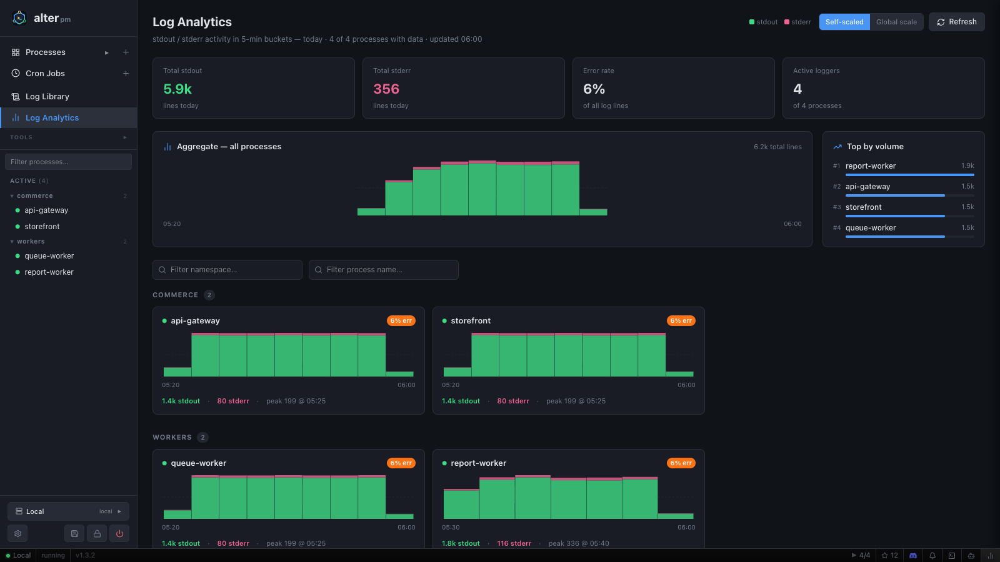
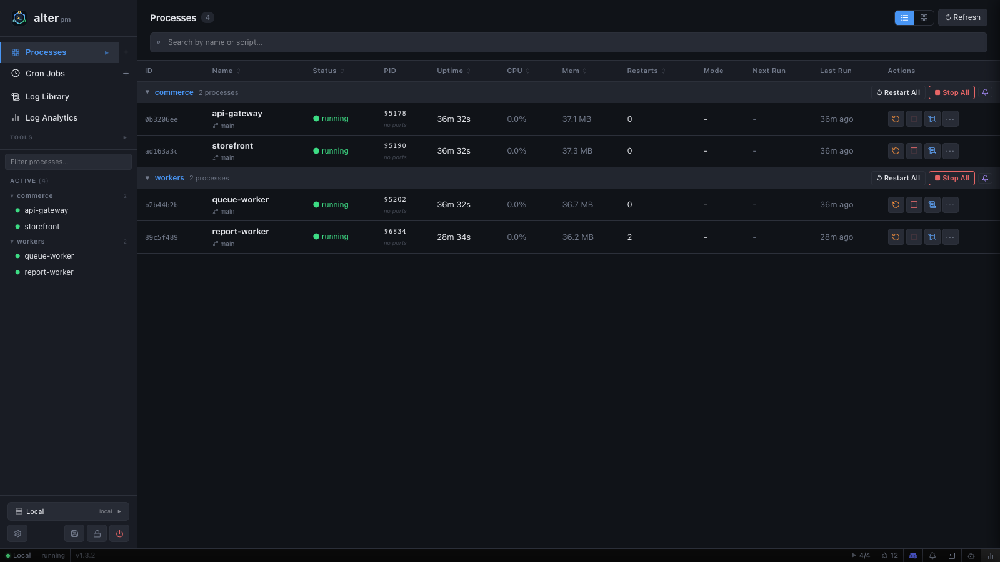
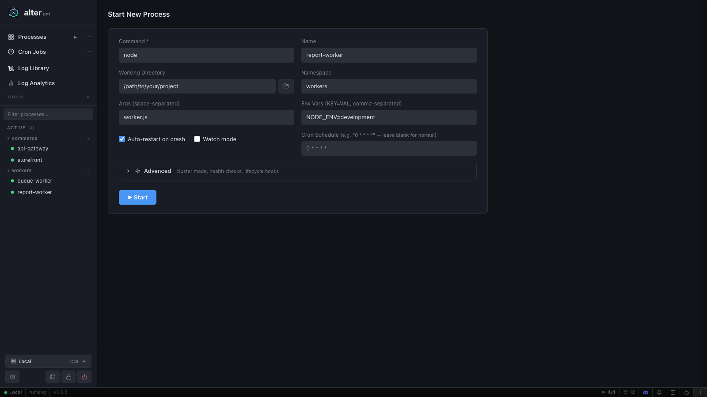
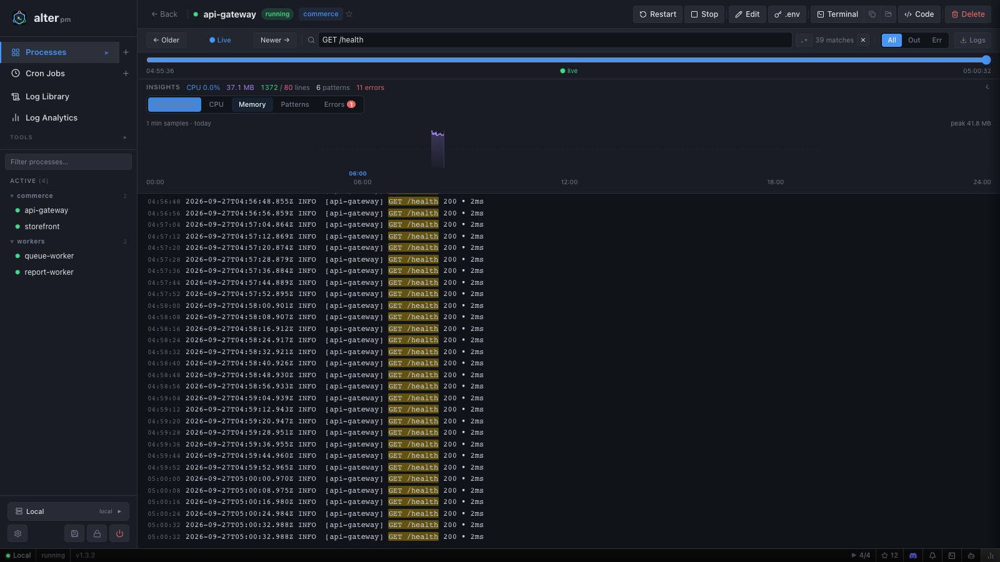
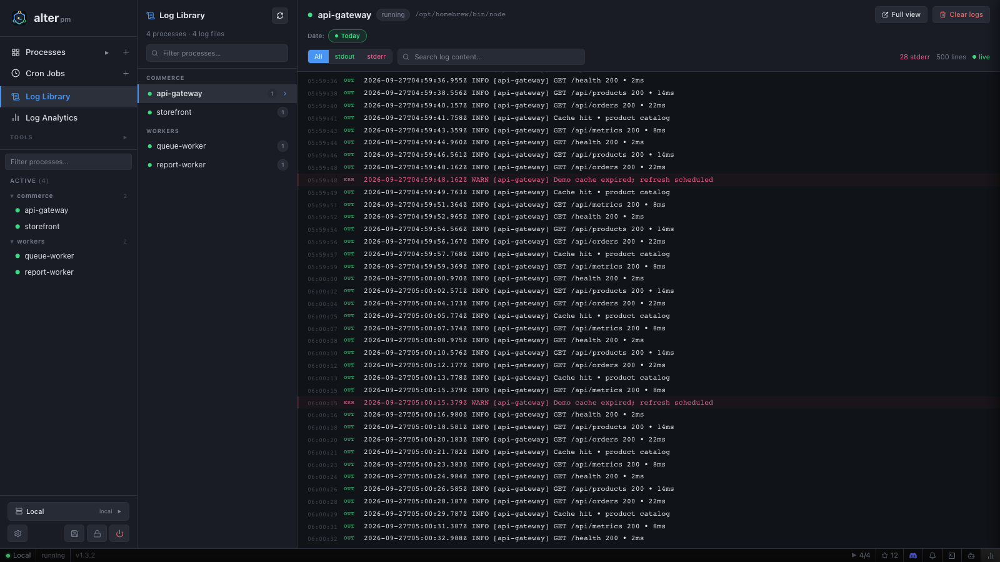
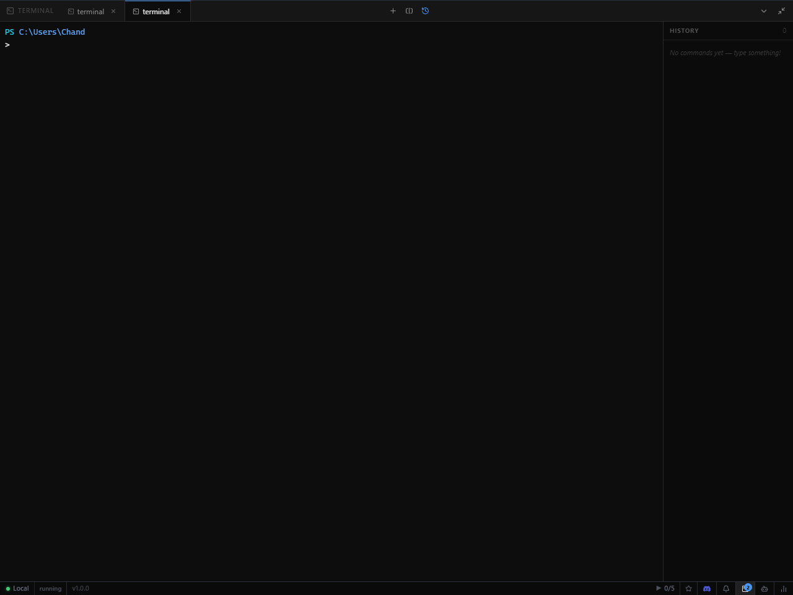
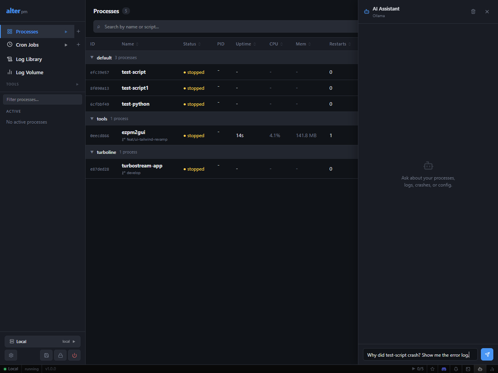

# alter — Process Manager

> A fast, lightweight process manager for Windows (and cross-platform). Run and manage any application — Python, Node.js, Go, Rust, .NET, PHP — from a single binary with a built-in web dashboard.

[](./LICENSE)
[](https://www.rust-lang.org/)

[](https://github.com/microsoft/winget-pkgs)

[User guide](https://alter-pm.chandanbhagat.com.np/) · [Video demos](#watch-the-demos) · [Quick start](#quick-start) · [Installation](#installation)



## Watch the demos

Three short walkthroughs of the real application, with narration and background music. The videos use local sample services.

<table>
  <tr>
    <td width="33%"><a href="https://youtu.be/F_sz2mlNNJs"></a></td>
    <td width="33%"><a href="https://youtu.be/LM7kWGhMk5U"></a></td>
    <td width="33%"><a href="https://youtu.be/TGzG2I--aw0"></a></td>
  </tr>
  <tr>
    <td><a href="https://youtu.be/F_sz2mlNNJs"><strong>Product overview ↗</strong></a><br />52 seconds · Status, resources, namespaces, and logs.</td>
    <td><a href="https://youtu.be/LM7kWGhMk5U"><strong>Launch, stop, and restart ↗</strong></a><br />55 seconds · Configure and control a background worker.</td>
    <td><a href="https://youtu.be/TGzG2I--aw0"><strong>Logs and monitoring ↗</strong></a><br />53 seconds · Filter output and compare service activity.</td>
  </tr>
</table>

[Follow the illustrated user guide →](https://alter-pm.chandanbhagat.com.np/#video-demos)

---

> [!WARNING]
> **For Developer Use Only**
>
> alter is a **local developer tool** designed to run on your personal development machine. It is **not intended for production use**. The daemon binds to `127.0.0.1` (localhost) and has not been hardened for public-facing or multi-user environments.
>
> If you choose to use alter in a production or publicly exposed environment, you do so **entirely at your own risk**. No security guarantees are made for such deployments.

## Quick Start

```powershell
# Start the daemon
alter daemon start

# Start processes
alter start python -- -m http.server 8080
alter start node --name api -- server.js
alter start "go run main.go" --name backend --cwd C:\projects\api

# List processes
alter list

# Stream logs
alter logs api --follow

# Open web dashboard
alter web    # → http://127.0.0.1:2999/
```

---

## Screenshots

### Organize and control your processes

Group related services into namespaces, inspect their status and resource usage, and start, stop, or restart them from the dashboard.



<details>
<summary><strong>Configure a new process</strong></summary>

Set the command, working directory, namespace, arguments, environment, and restart policy.



</details>

### Find the log line that matters

Filter live output and expand Insights for resource history. Use Log Library for saved output and Log Analytics to compare activity.



<details>
<summary><strong>Log Library and Log Analytics</strong></summary>




</details>

<details>
<summary><strong>Built-in terminal and AI assistant</strong></summary>





</details>

---

## Installation

### WinGet (recommended)

```powershell
winget install thechandanbhagat.alter
```

### Manual installer

Download the latest `alter-x.x.x-windows-x64-setup.exe` from [Releases](https://github.com/thechandanbhagat/alter-pm/releases) and run it.  
`alter.exe` is added to your `PATH` automatically.

### macOS

There is no prebuilt macOS download yet, so alter is built from source. It takes a few minutes and
works on both Apple Silicon and Intel Macs.

**1. Install the prerequisites** (skip any you already have)

```bash
xcode-select --install                                           # Apple command-line tools (C compiler + linker)
curl --proto '=https' --tlsv1.2 -sSf https://sh.rustup.rs | sh   # Rust — open a new terminal afterwards
brew install node                                                # Node.js 20.19+ (or use nvm / nodejs.org)
```

Node.js is only needed to build the dashboard — alter itself has no runtime dependencies.

**2. Build and install**

```bash
git clone https://github.com/thechandanbhagat/alter-pm
cd alter-pm
(cd web-ui && npm ci && npm run build)   # build the dashboard (embedded into the binary)
cargo install --path .                   # release build → ~/.cargo/bin/alter
alter --version
```

`~/.cargo/bin` is put on your `PATH` by the Rust installer. If `alter` is not found, open a new
terminal or run `source "$HOME/.cargo/env"`.

**3. Start the daemon and open the dashboard**

```bash
alter daemon start   # runs in the background — closing the terminal does not stop it
alter web            # opens http://127.0.0.1:2999/ in your browser
```

If port 2999 is taken, add `export ALTER_PORT=3000` to your `~/.zshrc` — every `alter` command
(including `daemon start`) then uses that port.

**4. Start automatically at login** (optional)

```bash
alter startup        # registers ~/Library/LaunchAgents/io.alter.daemon.plist
```

The login agent records your current `PATH`, so tools installed with Homebrew or nvm (`node`, `npm`,
`python3`, …) are found by your processes after a reboot. Run `alter startup` again whenever your
`PATH` changes, and `alter unstartup` to remove it.

**Updating**

```bash
cd alter-pm
git pull
(cd web-ui && npm ci && npm run build)
cargo install --path .
alter daemon restart   # restart the daemon on the new binary
```

**Uninstalling**

```bash
alter unstartup                # remove the login agent (if you added it)
alter stop all                 # stop managed processes — `daemon stop` leaves them running
alter daemon stop
cargo uninstall alter-gui      # the crate's package name; removes ~/.cargo/bin/alter
rm -rf ~/.alter-pm2            # optional: processes, logs and settings
```

**Troubleshooting**

| Problem | Fix |
|---------|-----|
| `cargo build` fails with `folder 'web-ui/dist/' does not exist` | Build the dashboard first: `(cd web-ui && npm ci && npm run build)` |
| A process started at login fails with `No such file or directory` | Its command isn't on the agent's `PATH` — run `alter startup` again from a terminal where the command works |
| `alter daemon start` says it didn't start within 5 s | Check `alter daemon logs` (daemon log: `~/.alter-pm2/daemon.log`) |
| Login agent didn't start the daemon | See `~/Library/Logs/alter-daemon.log` and `~/Library/Logs/alter-daemon-error.log` |

See [macOS & Linux](#macos--linux) for how alter behaves on Unix systems.

---

## Features

- **No console window popups** — processes run silently in the background (Windows)
- **Auto-restart** with exponential backoff on crash
- **Watch mode** — restart automatically on file changes
- **Namespaces** — group and bulk-control related processes
- **Web dashboard** — real-time process monitor at `http://localhost:2999/`
- **Live log streaming** — tail logs in terminal or browser
- **State persistence** — save and restore your process list across reboots
- **Ecosystem config** — define all apps in one TOML or JSON file
- **Full REST API** — automate everything
- **Single binary** — no runtime dependencies
- **Dashboard authentication** — password-protect the web UI with Argon2id hashing, session tokens, and a PIN quick-unlock
- **Telegram bot** — control your processes from Telegram: list, start, stop, restart, tail logs, and receive crash/restart alerts
- **AI assistant** — multi-provider chat panel (Ollama, GitHub Models, Claude, OpenAI-compatible) with streaming responses and process-aware context
- **Port Finder** — scan all open TCP/UDP ports, see owning processes, and kill by PID from the dashboard
- **Notifications** — Slack, Discord, Microsoft Teams, and webhook alerts on crash, restart, cron events, and more
- **Process enable/disable** — exclude individual processes from Start All without removing them
- **Terminal history** — per-process command history persisted across sessions
- **Sidebar namespace groups** — active processes grouped by namespace with collapsible sections and bulk stop/restart

### Build from source

Requires [Rust](https://rustup.rs/) and [Node.js](https://nodejs.org/) 20.19+. The dashboard is
embedded into the binary at compile time, so build `web-ui/` first — `cargo build` fails with
`folder 'web-ui/dist/' does not exist` otherwise.

```powershell
git clone https://github.com/thechandanbhagat/alter-pm
cd alter-pm
cd web-ui; npm ci; npm run build; cd ..
cargo build --release
# Binary: target\release\alter.exe
```

On macOS, follow the step-by-step [macOS installation](#macos) above. On Linux, also install
`pkg-config` and the OpenSSL headers (`sudo apt install pkg-config libssl-dev` on Debian/Ubuntu):

```bash
git clone https://github.com/thechandanbhagat/alter-pm
cd alter-pm
(cd web-ui && npm ci && npm run build)
cargo build --release
cp target/release/alter ~/.local/bin/   # or anywhere on your PATH
alter daemon start
```

---

## Windows

alter is built with Windows as a first-class platform:

- Spawned processes use `CREATE_NO_WINDOW` — **no black console popups**
- Daemon runs completely hidden in the background
- `npm`, `yarn`, `npx` and other `.cmd` scripts work directly
- Terminal button opens Windows Terminal or `cmd.exe` in the process directory
- Data stored in `%APPDATA%\alter-pm2\`

---

## macOS & Linux

- Data is stored in `~/.alter-pm2/`
- A `script` containing spaces (e.g. `npm run dev`) runs through `/bin/sh`, matching `cmd /C` on Windows
- Stopping a process terminates its whole process tree (`SIGTERM`, then `SIGKILL` after 5 s)
- `alter startup` registers a LaunchAgent (`~/Library/LaunchAgents/io.alter.daemon.plist`) on macOS or a
  user systemd unit on Linux. On macOS the agent records your shell's `PATH` (and `ALTER_PORT` /
  `ALTER_HOST` if set), so Homebrew/nvm tools such as `node` and `python3` resolve after login —
  re-run `alter startup` if your `PATH` changes
- Port Finder uses `lsof` on macOS and `ss` (or `netstat`) on Linux

---

## Ecosystem Config

```toml
# alter.config.toml
[[apps]]
name      = "api"
script    = "python"
args      = ["-m", "uvicorn", "main:app", "--port", "8000"]
cwd       = "C:\\projects\\api"
namespace = "web"
[apps.env]
PORT = "8000"

[[apps]]
name      = "worker"
script    = "node"
args      = ["dist/worker.js"]
watch     = true
namespace = "workers"
[apps.env]
NODE_ENV = "production"
```

```powershell
alter start alter.config.toml
```

---

## Documentation

Full documentation is in [`docs/`](./docs/):

| Document | Description |
|----------|-------------|
| [Illustrated User Guide](https://alter-pm.chandanbhagat.com.np/) | Video walkthroughs, screenshots, and feature documentation |
| [Markdown User Guide](./docs/USER_GUIDE.md) | Repository-friendly guide — installation, dashboard, all features |
| [README](./docs/README.md) | Full project overview and setup guide |
| [CLI Reference](./docs/CLI.md) | All commands, flags, and examples |
| [API Reference](./docs/API.md) | Full REST API documentation |
| [Ecosystem Config](./docs/ECOSYSTEM_CONFIG.md) | Config file format reference |
| [Architecture](./docs/ARCHITECTURE.md) | How alter works under the hood |
| [Changelog](./docs/CHANGELOG.md) | Version history |
| [Security](./docs/SECURITY.md) | Security |

---

## License

MIT — see [LICENSE](./LICENSE) for details.
