# alter — User Guide

> **alter** is a single-binary process manager for Windows, Linux, and macOS with a built-in web dashboard, terminal, Telegram bot, AI assistant, and more.

---

## Table of Contents

1. [Installation](#1-installation)
2. [First Launch](#2-first-launch)
3. [Interface Overview](#3-interface-overview)
4. [Managing Processes](#4-managing-processes)
5. [Terminal](#5-terminal)
6. [Log Library](#6-log-library)
7. [Cron Jobs](#7-cron-jobs)
8. [Ecosystem Files](#8-ecosystem-files)
9. [Tunnels](#9-tunnels)
10. [Port Finder](#10-port-finder)
11. [Remote Servers](#11-remote-servers)
12. [AI Assistant](#12-ai-assistant)
13. [Settings](#13-settings)
14. [Security](#14-security)
15. [Telegram Bot](#15-telegram-bot)
16. [Keyboard Shortcuts](#16-keyboard-shortcuts)
17. [Troubleshooting](#17-troubleshooting)

---

## 1. Installation

### Windows — WinGet (recommended)

```powershell
winget install thechandanbhagat.alter
```

### Windows — Manual installer

Download `alter-x.x.x-windows-x64-setup.exe` from [GitHub Releases](https://github.com/thechandanbhagat/alter-pm/releases/latest) and run it. `alter.exe` is added to your `PATH` automatically.

### Linux / macOS

```bash
# Linux x86_64
curl -Lo alter https://github.com/thechandanbhagat/alter-pm/releases/latest/download/alter-linux-x86_64
chmod +x alter && sudo mv alter /usr/local/bin/

# macOS arm64
curl -Lo alter https://github.com/thechandanbhagat/alter-pm/releases/latest/download/alter-macos-arm64
chmod +x alter && sudo mv alter /usr/local/bin/
```

### Build from source

Requires [Rust 1.77+](https://rustup.rs/).

```bash
git clone https://github.com/thechandanbhagat/alter-pm
cd alter-pm
cargo build --release
# Binary: target/release/alter  (Linux/macOS)
#         target/release/alter.exe  (Windows)
```

---

## 2. First Launch

```bash
# 1. Start the daemon (listens on http://127.0.0.1:2999)
alter daemon start

# 2. Open the dashboard in your browser
#    http://127.0.0.1:2999
```

On first visit you will be prompted to set a password. This password is hashed with **argon2id** and never stored in plain text.

> **Data directory**  
> Windows: `%APPDATA%\alter-pm2\`  
> Linux/macOS: `~/.alter-pm2/`  
> All state, logs, settings, and history are stored here.

### Daemon commands

```bash
alter daemon start          # Start in background
alter daemon stop           # Stop gracefully
alter daemon status         # Check running status
alter daemon start --port 4000   # Custom port
```

---

## 3. Interface Overview


### Navigation bar (top)

| Link | Description |
|------|-------------|
| **Processes ▼** | List and manage all processes. Dropdown shows namespace groups. |
| **Cron Jobs ▼** | Scheduled tasks. |
| **Log Library** | Unified log browser across all processes. |
| **Log Volume** | Visual chart of log output volume over time. |
| **TOOLS ▼** | Tunnels and Port Finder. |

### Sidebar

Shows the process filter, active namespace groups, and the footer controls (server switcher, settings, save state, lock, shutdown).

### Status bar (bottom)

Shows daemon connection status, GitHub star widget, Discord link, notifications, terminal toggle, AI assistant, and system stats.

---

## 4. Managing Processes

### Starting a process

Click **Start new process** in the navigation bar, or run from the CLI:

```bash
alter start node --name api -- server.js
alter start python --name worker --cwd /opt/app -- worker.py
alter start "npm run dev" --name frontend
```

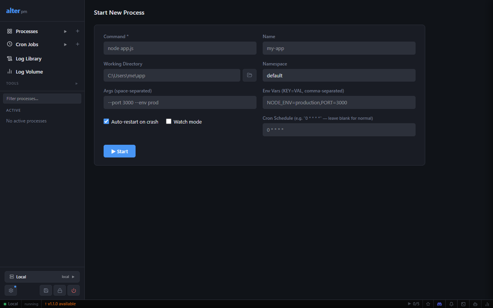

**Form fields:**

| Field | Description |
|-------|-------------|
| **Command** | Executable to run (e.g. `node`, `python`, `./my-script.sh`) |
| **Name** | Identifier shown in the dashboard and CLI |
| **Working Directory** | Directory from which the process runs |
| **Namespace** | Optional group label (e.g. `servers`, `workers`) |
| **Args** | Space-separated arguments passed after the command |
| **Env Vars** | `KEY=VAL` pairs, comma-separated |
| **Auto-restart on crash** | Restart automatically when the process exits unexpectedly |
| **Watch mode** | Restart when files in the working directory change |

### Process status

| Status | Meaning |
|--------|---------|
| 🟢 `running` | Process is alive and healthy |
| 🔴 `errored` | Process exited with a non-zero code or crashed |
| ⚫ `stopped` | Manually stopped |
| ⚫ `disabled` | Excluded from auto-start (row has a gray tint) |
| 🟡 `launching` | In the process of starting |

### Actions

Each row has action buttons: **Start/Stop**, **Restart**, **Logs** (opens log viewer), **Edit**, **Delete**.

Click a process **name** to open its detail page with live logs, CPU/memory charts, and full config.

### Enable / Disable

Disabling a process keeps it in the list but excludes it from **Start All** and auto-restart. Disabled rows show a subtle gray background and a grayed Start button. Toggle via the process detail page.

### Namespaces

Namespaces group related processes in the sidebar. Use them to filter the list or bulk-start/stop a set of processes (e.g. all `servers`).

---

## 5. Terminal


Click **Show terminal** in the status bar (or press `Ctrl+T`) to open the built-in xterm.js terminal.

### Tabs & split pane

- `Ctrl+T` — new tab  
- `Ctrl+Shift+T` — split current tab into two side-by-side panes  
- `Ctrl+W` — close current tab  

### Command history

History is persisted to `%APPDATA%\alter-pm2\terminal-history.json` (up to 150 commands per session).

- `↑` / `↓` — navigate history  
- Click the **history icon** (🕐) in the terminal toolbar to open the history sidebar — click any entry to paste it  

### Resize

Drag the top edge of the terminal panel to resize it. Use **Maximize** (⬜) to fill the screen.

---

## 6. Log Library

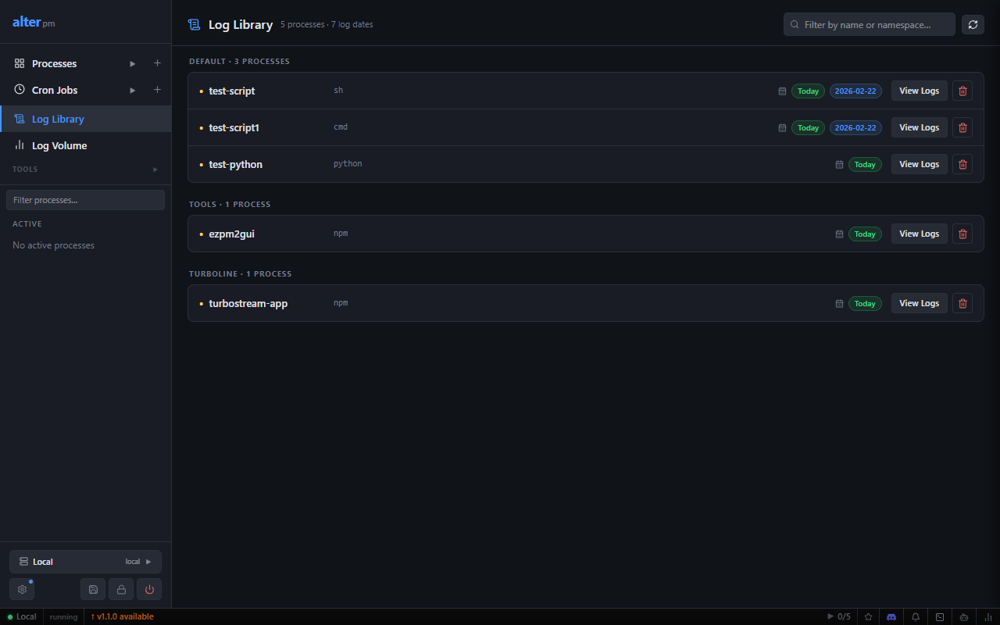

Navigate to **Log Library** to browse logs from every process in one place.

- **Search** — filter by keyword or regex across all log lines  
- **View Logs** — open the log viewer for a specific process  
- **Date badges** — colored badges show which dates have log files  
- **Delete** — remove a process's log files entirely  

### Log viewer features

- Real-time streaming via Server-Sent Events (SSE)  
- Line-level search and filter  
- Download full log file  
- Auto-scroll toggle  

### Log storage

```
Windows:      %APPDATA%\alter-pm2\logs\<name>\out.log  /  err.log
Linux/macOS:  ~/.alter-pm2/logs/<name>/out.log  /  err.log
```

### Log rotation (automatic)

| Setting | Value |
|---------|-------|
| Max file size | 10 MB per log file |
| Retained copies | 5 rotated files per process |
| Daily rotation | Midnight rollover |
| Archive retention | 30 days |

---

## 7. Cron Jobs


Navigate to **Cron Jobs → New cron job** to schedule a task.

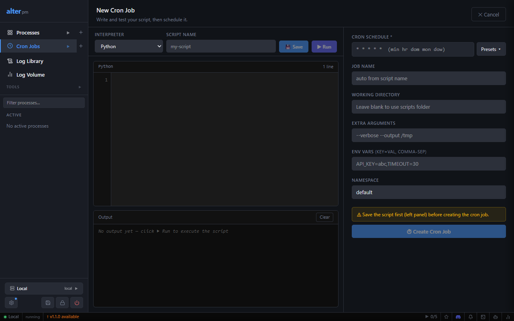

### Creating a cron job

The editor has two panels:

**Left panel — script editor**
- Choose an **interpreter** (Python, Node.js, Bash, PowerShell, etc.)
- Give the script a name and write or paste the script body
- Click **Run** to test it before scheduling

**Right panel — schedule & config**
- **Cron Schedule** — 5-field cron expression with a **Presets** dropdown
- **Job Name** — auto-filled from script name, or override
- **Working Directory**, **Extra Arguments**, **Env Vars**, **Namespace**
- Click **Create Cron Job** to save

### Common cron expressions

| Expression | Meaning |
|-----------|---------|
| `* * * * *` | Every minute |
| `0 * * * *` | Every hour |
| `0 9 * * *` | Daily at 9:00 AM |
| `0 9 * * 1-5` | Weekdays at 9:00 AM |
| `0 2 * * 0` | Every Sunday at 2:00 AM |
| `0 0 1 * *` | First of every month at midnight |

### Cron job list

Shows status, next run time, last run time, exit code, and actions (Run now, Edit, Delete).

---

## 8. Ecosystem Files

Define multiple processes in a single JSON or TOML file for reproducible setups.

### JSON format

```json
{
  "apps": [
    {
      "name": "web-server",
      "command": "node",
      "args": ["server.js"],
      "cwd": "/opt/app",
      "namespace": "production",
      "instances": 1,
      "env": { "PORT": "3000", "NODE_ENV": "production" },
      "autorestart": true
    },
    {
      "name": "worker",
      "command": "python",
      "args": ["worker.py"],
      "instances": 4,
      "autorestart": true
    }
  ]
}
```

### TOML format

```toml
[[apps]]
name      = "api"
command   = "python"
args      = ["-m", "uvicorn", "main:app"]
cwd       = "/opt/api"
namespace = "web"
[apps.env]
PORT = "8000"
```

### Starting from an ecosystem file

```bash
alter start alter.config.toml
alter start ecosystem.json
```

### Multi-instance

Set `"instances": N` (N > 1) to spawn multiple copies. They are named `worker-0`, `worker-1`, … `worker-N-1`. Use the rolling restart API for zero-downtime deploys:

```bash
# Rolling restart via API
curl -X POST http://127.0.0.1:2999/api/v1/processes/group/worker/rolling-restart \
  -H "Authorization: Bearer <token>" \
  -H "Content-Type: application/json" \
  -d '{"config": {...}}'
```

---

## 9. Tunnels

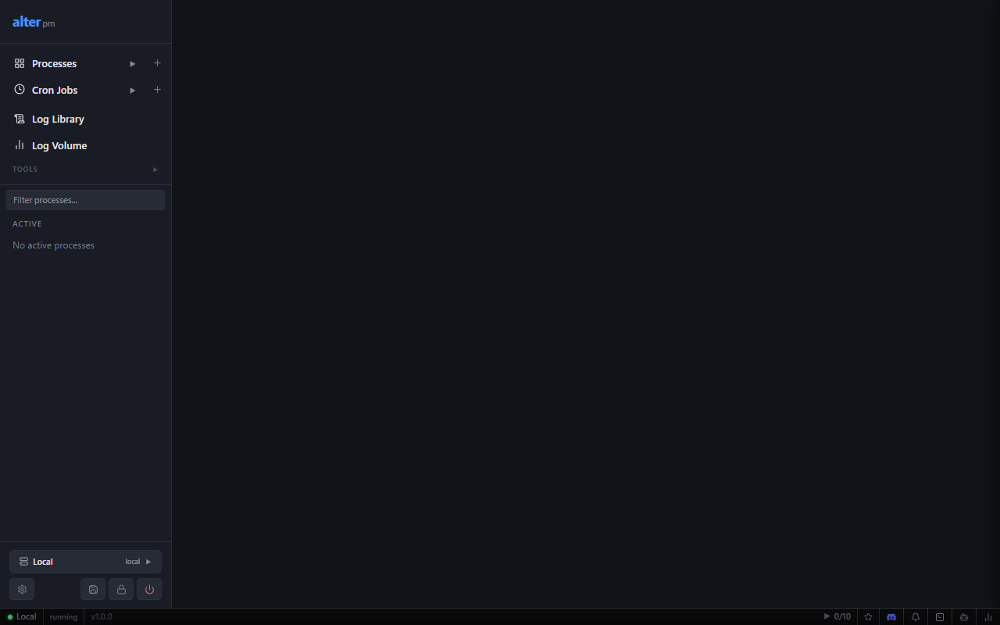

Expose local ports to the internet. Navigate to **TOOLS → Tunnels**.

### Creating a tunnel

1. Click **New tunnel**
2. Enter the local **port** (e.g. `3000`)
3. Choose a provider: **Cloudflare**, **ngrok**, or **Custom**
4. Click **Start** — alter captures the public URL from the process output

### Providers

| Provider | Free tier | Auth required |
|----------|-----------|---------------|
| Cloudflare | ✅ Yes (with account) | Cloudflare auth token |
| ngrok | ✅ Limited (1 tunnel) | ngrok auth token |
| Custom | Varies | Binary path + args template |

Configure credentials in [Settings → Tunnels](#settings--tunnels).

---

## 10. Port Finder

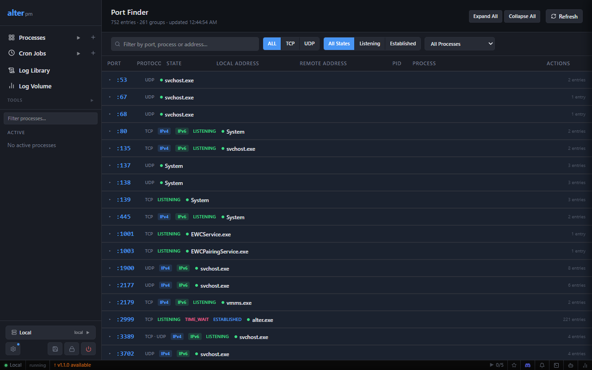

Navigate to **TOOLS → Port Finder** to see all active TCP/UDP listeners on the host.

Columns: **Port**, **Protocol**, **State**, **Local address**, **Remote address**, **PID**, **Process name**.

- Filter by protocol (TCP / UDP / All)
- Search by port number, process name, or address
- **Tunnel** button on LISTENING rows — instantly expose that port

---

## 11. Remote Servers

Connect to alter daemons on remote machines. Click the **server switcher** (bottom-left of sidebar).

### Connection types

**Direct** — daemon accessible on its HTTP port (LAN, VPN, public IP)

| Field | Description |
|-------|-------------|
| Host | IP or hostname of the remote machine |
| Port | Daemon port (default: 2999) |

**SSH tunnel** — access via SSH port forwarding

| Field | Description |
|-------|-------------|
| SSH host | Remote machine hostname or IP |
| SSH port | SSH server port (default: 22) |
| SSH user | Username for SSH login |
| SSH key path | Path to private key (optional; uses SSH agent if omitted) |
| Local forward port | Which local port to bind |
| Remote daemon port | Daemon port on the remote machine (default: 2999) |

> Remote server configs are stored in `remote-servers.json` in the data directory — not in the browser. They persist across sessions and are shared between browsers.

---

## 12. AI Assistant


Click the **AI** button in the status bar to open the assistant panel.

### Supported providers

| Provider | Type | Setup |
|----------|------|-------|
| **Ollama** | Local | Install [Ollama](https://ollama.ai), pull a model, set base URL |
| **GitHub Copilot** | Cloud | Active Copilot subscription + OAuth Device Flow sign-in |
| **Claude (Anthropic)** | Cloud | API key from [console.anthropic.com](https://console.anthropic.com) |
| **OpenAI** | Cloud | API key (`sk-…`); supports custom base URLs (Azure, Groq, LM Studio) |

### Quick setup (Ollama)

```bash
# 1. Install Ollama and pull a model
ollama pull llama3.2

# 2. In alter: Settings → AI → Provider: Ollama (local)
#    Base URL: http://localhost:11434
#    Click Refresh to load models → Save
```

### Example queries

- *"Why did test-script crash? Show me the error log."*
- *"What processes are currently running?"*
- *"How do I configure auto-restart?"*
- *"Show me the last 20 error lines from api-worker."*

---

## 13. Settings

Navigate to ⚙️ **Settings** (sidebar footer).

### General

| Setting | Description |
|---------|-------------|
| Auto-refresh | Toggle automatic daemon polling |
| Process refresh interval | How often the process list updates (1s–60s) |
| Health check interval | How often daemon connection is checked |
| Confirm before delete | Show confirmation dialog before deleting |
| Default tail lines | Log lines to load when opening a log view (50–5000) |
| Default namespace | Pre-filled namespace for new processes |
| Restart daemon | Restarts the HTTP server only; processes keep running |
| Check for updates | Query GitHub Releases for newer versions |

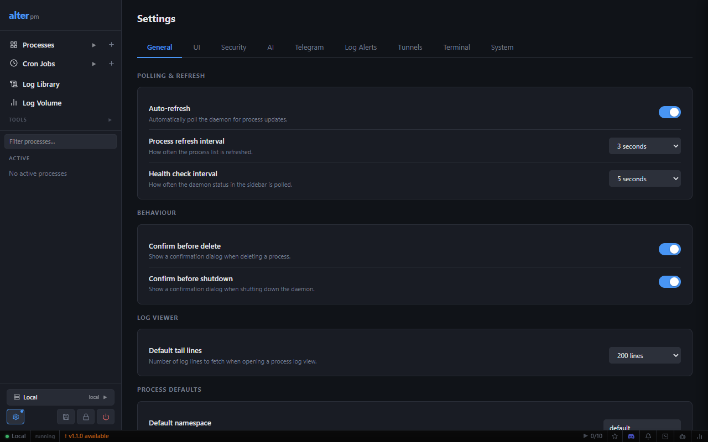

### UI

| Setting | Description |
|---------|-------------|
| Theme | Dark, Light, or System |
| Accent color | Primary color for buttons and highlights |
| Process view mode | Default view: Table or Card |
| Compact mode | Reduce padding for higher density |

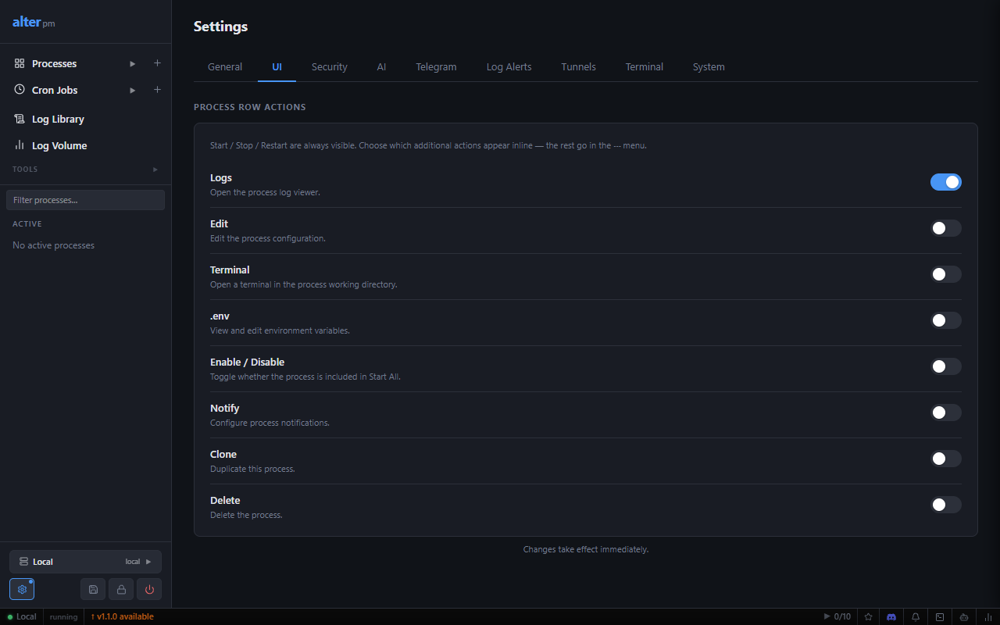

### Security

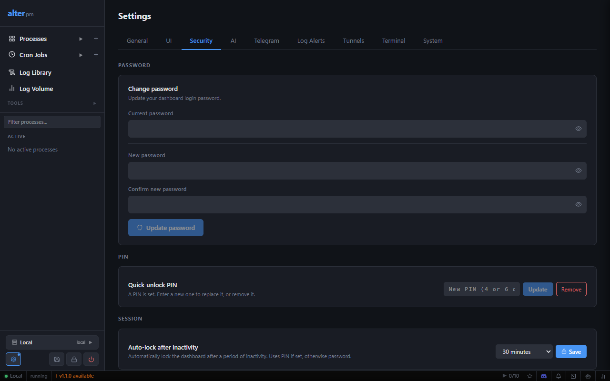

- **Change password** — minimum 8 characters; strength meter shown
- **Quick-unlock PIN** — 4 or 6 digit numeric PIN for the lock screen
- **Auto-lock** — lock after 5 min / 15 min / 30 min / 1 hour of inactivity

### AI

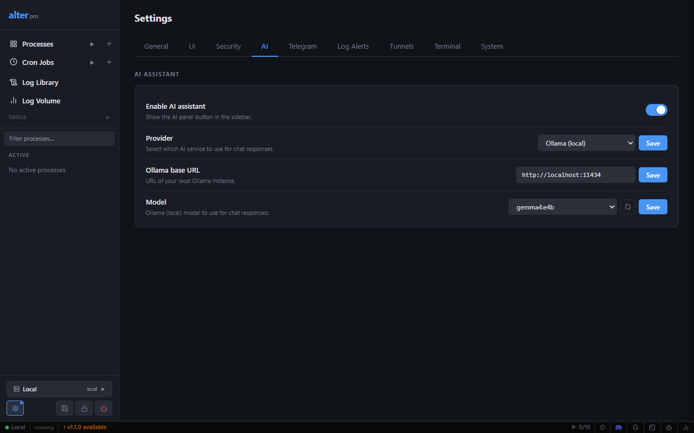

Configure the AI assistant provider and model. See [AI Assistant](#12-ai-assistant).

### Telegram

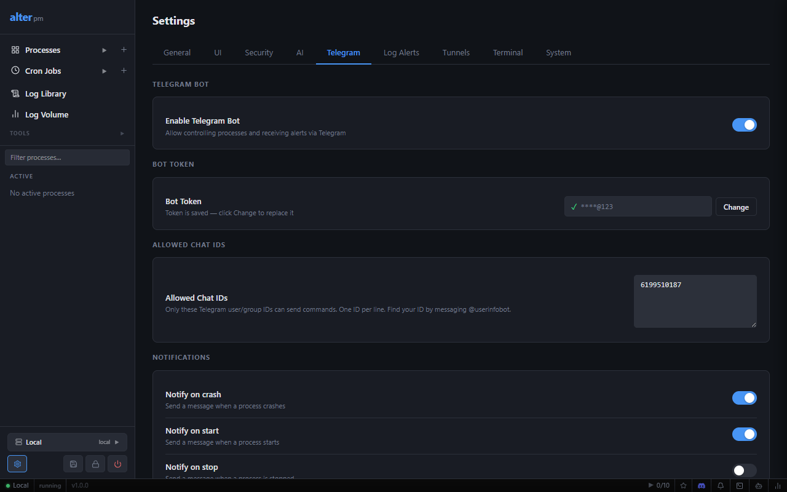

Configure the Telegram bot. See [Telegram Bot](#15-telegram-bot).

### Log Alerts

Set regex patterns on process log output. When a line matches, receive an in-app notification or Telegram alert with a configurable cooldown.

### Tunnels

Set default provider credentials (Cloudflare token, ngrok auth token, or custom binary).

### Terminal

| Setting | Description |
|---------|-------------|
| Shell | Default shell (`bash`, `zsh`, `powershell`, `cmd`) |
| Font size | Terminal font size in pixels |
| Scrollback lines | Lines kept in the terminal buffer |
| Cursor style | Block, underline, or bar |

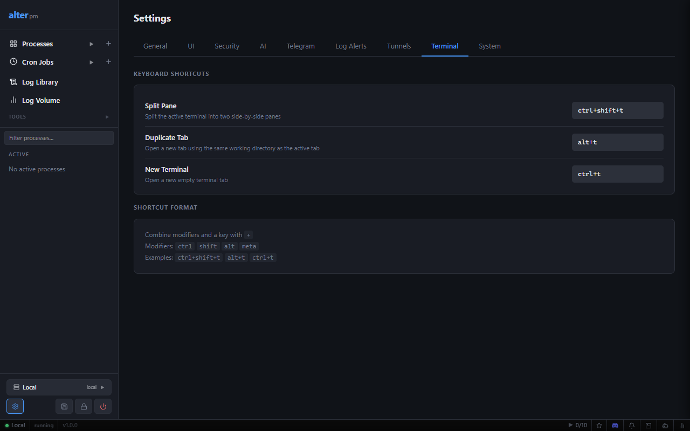

### System

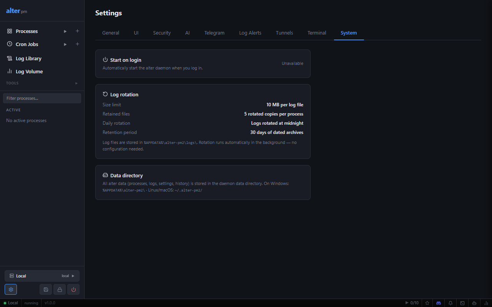

- **Start on login** — register/unregister OS autostart
  - Windows: `SCHTASKS /ONLOGON`
  - Linux: systemd user unit
  - macOS: launchd plist
- **Log rotation info** — current settings (automatic, no config needed)
- **Data directory** — paths for Windows and Linux/macOS

---

## 14. Security

### How authentication works

- Password stored as **argon2id** hash in `auth.json`
- Browser sessions: 24-hour tokens stored server-side
- CLI master token: never expires, used by the `alter` binary itself
- All `/api/v1/**` routes require authentication except `/api/v1/auth/**`

### Lock screen

Click **Lock screen** in the sidebar footer (or wait for the inactivity timer). Unlock with your PIN (if set) or full password.

### Rate limiting

Login attempts are rate-limited to prevent brute-force attacks.

---

## 15. Telegram Bot

### Setup

1. Message **@BotFather** on Telegram → `/newbot` → copy the token
2. In alter: **Settings → Telegram** → paste token → click **Validate**
3. Message your bot, then message **@userinfobot** to get your numeric Chat ID
4. Add the Chat ID to **Allowed Chat IDs** (one per line)
5. Enable the bot → **Save** → **Send Test Message**

> Messages from Chat IDs not in the allowlist are silently ignored.

### Commands

| Command | Description |
|---------|-------------|
| `/list` | List all processes and their status |
| `/start <name>` | Start a process |
| `/stop <name>` | Stop a process |
| `/restart <name>` | Restart a process |
| `/logs <name> [lines]` | Show recent log lines (default 20) |
| `/status <name>` | Show detailed status (PID, uptime, restarts) |
| `/ping` | Check if the bot is reachable |
| `/help` | List all commands |

### Notification events

| Event | Default |
|-------|---------|
| Crash | ✅ On |
| Restart | ✅ On |
| Start | Off |
| Stop | Off |

---

## 16. Keyboard Shortcuts

| Shortcut | Action |
|----------|--------|
| `Ctrl+T` | New terminal tab |
| `Ctrl+Shift+T` | Split terminal pane |
| `Ctrl+W` | Close terminal tab |
| `↑` / `↓` | Navigate terminal command history |
| `Ctrl+L` | Clear terminal screen |
| `Ctrl+C` | Interrupt running command |

---

## 17. Troubleshooting

### Dashboard won't load

```bash
alter daemon status
curl http://127.0.0.1:2999/api/v1/health
```

Check firewall rules if accessing remotely.

### Can't build on Windows (locked binary)

The daemon locks `alter.exe` while running. Stop it first:

```powershell
$token = (Get-Content "$env:APPDATA\alter-pm2\auth.json" | ConvertFrom-Json).master_token
Invoke-RestMethod -Method POST http://127.0.0.1:2999/api/v1/system/shutdown `
  -Headers @{ Authorization = "Bearer $token" }
```

### Process keeps crashing

1. Open the log viewer — check the last error lines
2. Verify the working directory and command path are correct
3. Check required env vars are set in the process config

### Telegram bot not responding

1. Click **Validate** in Settings → Telegram to confirm the token is valid
2. Ensure your Chat ID is in the Allowed Chat IDs list
3. Confirm the daemon is running (`alter daemon status`)
4. Use **Send Test Message** to check end-to-end delivery

### Auto-restart not triggering

- Check **Auto-restart on crash** is enabled (edit the process)
- Confirm the process is not **disabled**
- The process must exit with a non-zero code — clean exits don't trigger restart

### Settings not saving

- Confirm the daemon is running and reachable
- Try logging out and back in (session may have expired)
- Check the data directory is writable

### OS startup not registering (Windows)

Run as administrator. Verify with:

```powershell
schtasks /query /tn alter-daemon
```

---

## Related documentation

| Document | Description |
|----------|-------------|
| [CLI Reference](./CLI.md) | All CLI commands and flags |
| [API Reference](./API.md) | Full REST API documentation |
| [Ecosystem Config](./ECOSYSTEM_CONFIG.md) | Config file format |
| [Architecture](./ARCHITECTURE.md) | How alter works internally |
| [Changelog](./CHANGELOG.md) | Version history |

---

*alter v1.1.0 · [GitHub](https://github.com/thechandanbhagat/alter-pm) · [Discord](https://discord.gg/vxerDZgHJg)*
